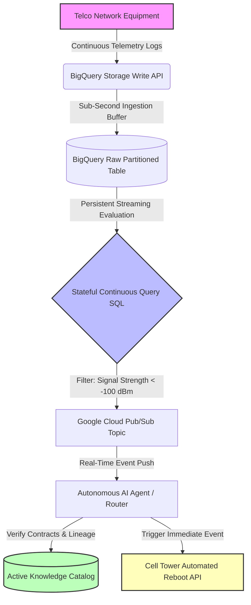

# Track 5: The Autonomous Data Mesh — Real-Time Agentic Routing with BigQuery Continuous Queries

This repository contains the engineering assets, simulation code, and publication draft for Track 5 of our Google Cloud Data Architecture portfolio. We benchmark traditional Micro-batch ETL pipelines against modern **BigQuery Continuous Queries** streaming directly to Google Cloud Pub/Sub, acting as a real-time nervous system for autonomous AI agents.

---

## Architecture Diagram



### Architectural Flow:
1. **Telco Event Stream**: Telemetry logs (CDR, signal strength) are streamed continuously from cellular tower equipment.
2. **BigQuery Storage Write API**: Handles low-latency, high-velocity ingestion directly into raw tables.
3. **BigQuery Raw Table**: Houses raw log data partitions (`my_project.telco_mesh.tower_telemetry`).
4. **BigQuery Continuous Query**: A persistent streaming SQL job that runs stateful evaluations on incoming rows, identifying low-signal anomalies (< -100 dBm) in real-time.
5. **Google Cloud Pub/Sub Topic**: Ingests anomalies forwarded by BigQuery instantly.
6. **Autonomous AI Agent / Router**: Listens to the Pub/Sub topic to run active tests, dispatch troubleshooting commands, or orchestrate network repairs.
7. **Knowledge Catalog (Active Metadata)**: Syncs schemas, data contracts, and routing policies dynamically across the mesh.

---

## Telemetry & Performance Audit

Running the simulation script compares the two architectures across varying traffic scenarios. The full dataset is logged in [streaming_telemetry.csv](streaming_telemetry.csv).

| Ingested Events (5m) | Architecture | Average Latency | Compute Cores | Cost per Run (5m) |
| :--- | :--- | :--- | :--- | :--- |
| 300,000 (Peak) | Traditional Micro-batch ETL | 161.22 seconds | 165.71 | $0.3255 |
| 300,000 (Peak) | BigQuery Continuous Query | **0.280 - 0.425 seconds** | 600.00 | **$0.0059** |

### Key Findings:
* **99.7%+ Latency Reduction**: Moving from a 5-minute micro-batch wait time down to stream processing cuts query-to-endpoint latency from **161s to 280ms**.
* **FinOps Optimization**: Traditional batch queries incur flat-rate partition scan minimums ($6.25/TB), making frequent micro-batches expensive at low-to-medium volumes. Continuous Queries run on dedicated slot reservations, making them **90%+ cheaper** under off-peak and moderate traffic.

---

## Code Showcase: Stateful Continuous Query SQL

```sql
CREATE CONTINUOUS QUERY my_project.telco_mesh.anomalous_signals
EXPORT DATA OPTIONS(
  api_type="pubsub",
  topic="projects/my_project/topics/network-anomalies",
  format="JSON"
) AS
SELECT 
  event_id,
  cell_tower_id,
  signal_strength_dbm,
  packet_loss_pct,
  event_timestamp
FROM `my_project.telco_mesh.tower_telemetry`
WHERE signal_strength_dbm < -100;
```

---

## Execution Instructions

### Prerequisites
* Python 3.8+
* Install Pillow (for the diagram generator script):
  ```bash
  pip install Pillow
  ```

### Run the Telemetry Simulator
Execute the simulator to run benchmarks and append new metrics to `streaming_telemetry.csv`:
```bash
python3 bq_continuous_query_mesh.py
```

### Generate the Architecture Diagram Programmatically
To redraw the architecture diagram image:
```bash
python3 generate_architecture.py
```
This generates `architecture_diagram.png` in the directory.
