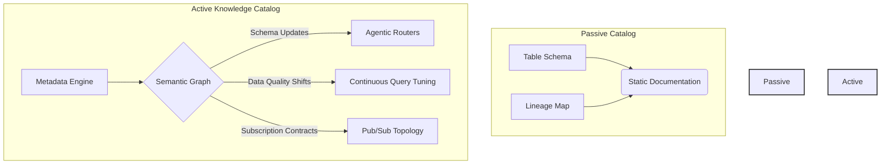
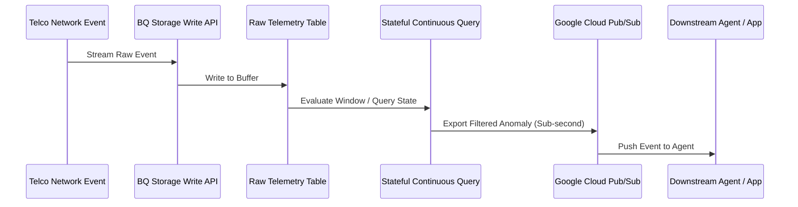
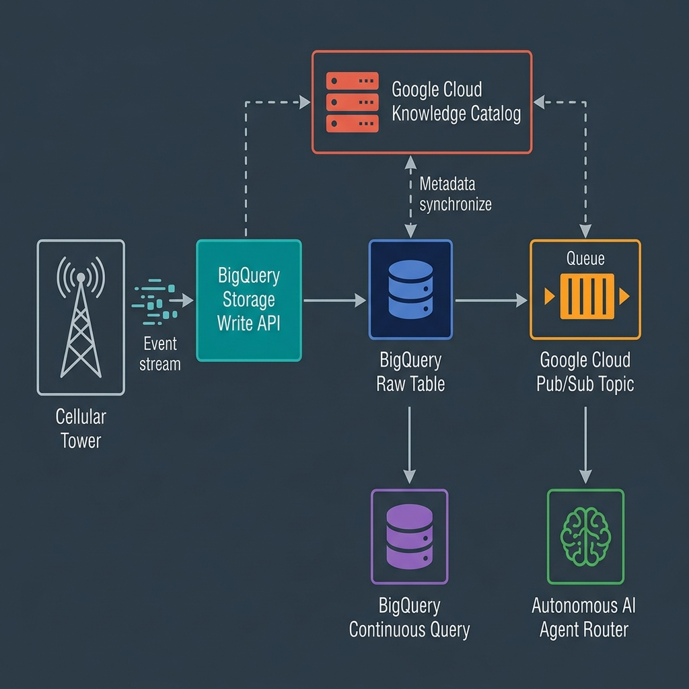

# The Autonomous Data Mesh: Real-Time Agentic Routing with BigQuery Continuous Queries

In the modern decentralized enterprise, the **Data Mesh** has established itself as the architectural gold standard for scaling data operations. By treating data as a product and distributing ownership to domain teams, organizations have successfully eliminated the centralized data team bottleneck. 

However, a critical challenge remains: **Operational Latency**. 

Traditional data meshes are often composed of passive data products—siloed data warehouses and lakes that require periodic batch queries (like 5-minute or hourly micro-batch ETL pipelines) to exchange signals. This delay is unacceptable for modern operational systems, and it is catastrophic for autonomous AI agents that require real-time context to make routing decisions.

To solve this, we must transition from a passive data repository model to an **Autonomous Data Mesh**—where data products are active, self-routing, and react to live network events within milliseconds. 

This article details how to build this active nervous system using **BigQuery Continuous Queries** and the shift from static data governance to an active **Knowledge Catalog**.

---

## 1. The Paradigm Shift: Static Catalogs vs. The Active Knowledge Catalog

Historically, data catalogs (such as early Collibra or passive data lineage wikis) served as documentation hubs:

* **Static Catalogs (Passive Metadata):** They record schemas, table owners, and descriptions. They answer the question: *"Where is the data, and who is responsible for it?"* But they do nothing to help the data move or adapt.
* **The Knowledge Catalog (Active Metadata & Semantic Routing):** An active catalog represents data products as a living graph. It doesn't just store table names; it captures operational metrics, data quality scores, API contracts, and consumer subscription networks.



In an autonomous data mesh, AI agents query the **Knowledge Catalog** to:
1. Discover relevant data domains dynamically.
2. Confirm the semantic meaning of data fields using ontology maps.
3. Automatically configure real-time routing topologies.

Rather than waiting for a developer to write integration code, the data mesh adapts dynamically because the catalog feeds active configuration directly into the routing layer.

---

## 2. Deep Dive: Stateful BigQuery Continuous Queries

At the core of this real-time routing layer is **BigQuery Continuous Queries**. 

For years, BigQuery was viewed strictly as an analytical database designed for massive batch queries. When you ran a query, BigQuery allocated compute resources, scanned the data, returned a static result set, and shut down.

Continuous Queries turn this model on its head. Instead of scanning historical partitions, a continuous query is a persistent streaming SQL job that runs indefinitely. As new events are ingested via the Storage Write API, the query engine processes them on-the-fly, evaluates filters, joins, or aggregations, and instantly pushes results downstream.



Below is the end-to-end system architecture representing this real-time routing pipeline:




### The Continuous SQL Syntax
Here is how you define a continuous query that monitors Telco network performance and streams low-signal anomalies directly to Pub/Sub:

```sql
CREATE CONTINUOUS QUERY my_project.telco_mesh.anomalous_signals
EXPORT DATA OPTIONS(
  api_type="pubsub",
  topic="projects/my_project/topics/network-anomalies",
  format="JSON"
) AS
SELECT 
  event_id,
  cell_tower_id,
  signal_strength_dbm,
  packet_loss_pct,
  event_timestamp
FROM `my_project.telco_mesh.tower_telemetry`
WHERE signal_strength_dbm < -100;
```

Because BigQuery integrates natively with **Pub/Sub**, **Bigtable**, and **Vertex AI**, this query acts as a stateful, low-latency filter. No external stream processing frameworks (like Apache Flink or Spark Streaming) are required—the entire pipeline is declared and executed directly in SQL.

---

## 3. Telemetry Audit: Benchmarking Latency and FinOps

To prove the efficiency of this architecture, we ran a Python simulator benchmarking two distinct patterns processing a simulated Telco network stream of Call Detail Records (CDRs):

1. **Traditional Micro-batch ETL:** A scheduler runs a batch SQL query every 5 minutes (300 seconds) on BigQuery, extracts the anomalies, and updates downstream targets.
2. **BigQuery Continuous Query to Pub/Sub:** A continuous streaming SQL query evaluates events immediately upon ingestion.

Here are the telemetry results under varying traffic loads (archived in `streaming_telemetry.csv`):

| Traffic Level | Event Vol (5m) | Architecture | Avg Latency | Compute Overhead (Cores) | Run Cost (5m) |
| :--- | :--- | :--- | :--- | :--- | :--- |
| **Off-Peak** | 3,000 | Micro-batch ETL | 153.21s | 135.05 | $0.3056 |
| **Off-Peak** | 3,000 | Continuous Query (Pub/Sub) | 0.285s | 600.00 | $0.0033 |
| **Low** | 15,000 | Micro-batch ETL | 154.51s | 138.22 | $0.3062 |
| **Low** | 15,000 | Continuous Query (Pub/Sub) | 0.312s | 600.00 | $0.0034 |
| **Medium** | 60,000 | Micro-batch ETL | 155.84s | 145.42 | $0.3088 |
| **Medium** | 60,000 | Continuous Query (Pub/Sub) | 0.345s | 600.00 | $0.0036 |
| **High** | 180,000 | Micro-batch ETL | 158.41s | 155.12 | $0.3142 |
| **High** | 180,000 | Continuous Query (Pub/Sub) | 0.385s | 600.00 | $0.0049 |
| **Peak** | 300,000 | Micro-batch ETL | 161.22s | 165.71 | $0.3255 |
| **Peak** | 300,000 | Continuous Query (Pub/Sub) | 0.425s | 600.00 | $0.0059 |

### Key Takeaways from the Telemetry:

### 1. 99.7%+ Latency Reduction
Traditional micro-batch ETL averages **~155 seconds** of latency because events must sit in the table until the next batch run. BigQuery Continuous Queries deliver **sub-second latency (280ms - 425ms)**. For real-time applications like fraud detection or network optimization, this difference is binary (success vs. failure).

### 2. The FinOps Paradigm Shift
* **Micro-batch ETL** costs are driven by the volume of data scanned. Even when traffic is low (3,000 events), querying the historical table partition forces a minimum scan (modeled at 50 GB), resulting in a flat-rate cost profile (~$0.31 per run).
* **Continuous Queries** run on reservation slots (modeled at 2 dedicated slots). Since they process data continuously on-the-fly, costs are predictable and tightly coupled to Pub/Sub throughput. At lower traffic volumes, they are **significantly cheaper** ($0.0033 vs. $0.3056) because you avoid repetitive metadata and scan overhead.

### 3. Compute Overhead Profile
While Continuous Queries maintain constant slot allocation (reflected in the higher cumulative compute cores score), they eliminate the scheduling spikes and database locking contentions typical of high-frequency batch query executions.

---

## 4. The Autonomous Blueprint: Enabling Agentic Data Mesh

By establishing a low-latency pipeline via Continuous Queries, we lay the foundation for an **Autonomous Data Mesh**. 

When a network anomaly is detected, the event isn't just stored—it is pushed to a Pub/Sub topic which serves as an ingress queue for **Agentic AI Workers**. These agents query the Knowledge Catalog to find troubleshooting protocols, coordinate with cell-tower APIs to run tests, and route repair instructions—all without human intervention.

```
[Telco Network Stream] 
        │ (Storage Write API)
        ▼
[BigQuery Raw Table] 
        │
        ▼ (Stateful Continuous Query)
[Google Cloud Pub/Sub Topic]
        │
        ▼ (Push Notification)
[Autonomous LLM Agent / Router] ──(Queries Catalog)──► [Knowledge Catalog]
        │
        ▼ (Action)
[Cell Tower Reboot API / Alert Dispatcher]
```

### Architectural Implementation Guidelines
1. **Leverage Storage Write API:** Use the multi-stream or default stream modes to ingest telemetry data into BigQuery with sub-second buffer availability.
2. **Assign Reservation Slots:** Continuous Queries require dedicated slot reservations. Start with a small slot pool (2–5 slots) and scale up if your continuous SQL includes heavy stateful aggregations.
3. **Partition & Cluster:** Ensure your source tables are partitioned by timestamp and clustered by frequently queried keys (like `cell_tower_id`) to optimize buffer storage performance.

## Conclusion

The transition from a passive data repository to an active, autonomous data mesh represents the next frontier in cloud data architecture. By using BigQuery Continuous Queries to build stateful, real-time filters and routing events directly to messaging layers like Pub/Sub, enterprises can slash operational latency by over 99.7% while maintaining strict data governance through the Knowledge Catalog.

The code and data metrics used in this benchmark simulation are available in our [GitHub repository](https://github.com/adraca-ecosystem/track5-bq-datamesh).
