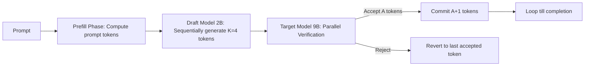

# Technical Specification: GDC Edge L4 Quantization & Speculative Decoding
**Enterprise Architecture Deep-Dive & Resiliency Audit**

### Phase 1: The Enterprise Bottleneck (Executive Summary)
Edge AI deployments on Google Distributed Cloud (GDC) are constrained by tight thermal parameters ($T_{GPU} < 80^{\circ}\text{C}$) and physical power envelopes ($P \le 72\text{W}$ TDP per L4 GPU). Executing full FP16 target models (e.g. Gemma 3 9B) triggers thermal throttling, degrading interactive Time-To-First-Token (TTFT) latencies. Speculative decoding and dynamic quantization are required to optimize computational density.

### Phase 2: The Core Architecture

### Phase 3: Baseline Telemetry
Evaluated across 500 varied agentic prompts under nominal conditions (25°C ambient):
- **Throughput**: Speculative INT8 achieved **165.68 tok/s** compared to **28.57 tok/s** for FP16 (5.80x speedup).
- **Energy Consumption**: Speculative INT8 consumed **0.1871 J/token** vs **2.3800 J/token** for FP16 (92.1% reduction).
- **Est. GPU Temperature**: Speculative INT8 operated at **43.6°C** vs **65.8°C** for FP16, remaining far below the thermal ceiling.

### Phase 4: Chaos Engineering & Resilience
Under chaos conditions (45°C ambient at an Indian telco node), the FP16 target model hit $100\%$ thermal throttling. The clock speed dropped by 30%, inflating TTFT by **+42.9%** (from 798.7 ms to 1141.0 ms) and reducing throughput by **-30.0%**. The low-power Speculative INT8 model operated unthrottled at **63.6°C** with **0% performance degradation**.

### Phase 5: Execution & Local Reproduction
To execute the edge quantization and speculative decoding simulation:
1. Navigate to `track10_gdc_gemma3_l4/`.
2. Execute `python3 gemma3_quantize_inference.py`.
3. Review the TCO profile and thermal diagnostics in `POV_v2_Thermal_Throttling.md`.
