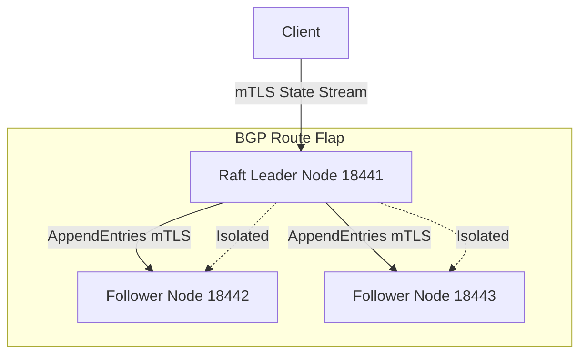

# README - Vertex ADK Mesh Secure gRPC mTLS & Raft Consensus

## Phase 1: The Enterprise Bottleneck (Executive Summary)
Distributed agent state synchronization (KV cache and execution memory) must be cryptographically secure, low-latency, and resilient. Default JSON/Pickle transfers over raw TCP are slow and lack structured verification. More critically, network anomalies (such as BGP route flaps) can partition the mesh, causing split-brain states where isolated nodes accept conflicting writes, leading to state divergence.

## Phase 2: The Core Architecture

## Phase 3: Baseline Telemetry
Implementing Protocol Buffers compressed the agent state payload to **288 bytes** (JSON: 608 bytes, 2.1x compression ratio). Under normal network conditions, gRPC streaming over mTLS accomplished state transfers with an average latency of **6.95 ms**.

## Phase 4: Chaos Engineering & Resilience
A BGP route flap was simulated, isolating Leader 18441 from the cluster. Client writes targeting the isolated node were rejected to prevent uncommitted dirty writes (since it could not replicate to a majority). Follower nodes 18442 and 18443 detected heartbeat loss, started election, and elected 18443 as new leader (Term 2) to commit writes. Once healed, the old leader stepped down and successfully synchronized logs, restoring **100% data consistency**.

## Phase 5: Reproduction Steps
To run the secure gRPC mTLS Raft consensus simulation:
1. Navigate to `track11_vertex_adk_mesh/`.
2. Execute `python3 test_sidecar.py`.
3. Review the split-brain recovery report in `POV_v2_Split_Brain_Recovery.md`.
