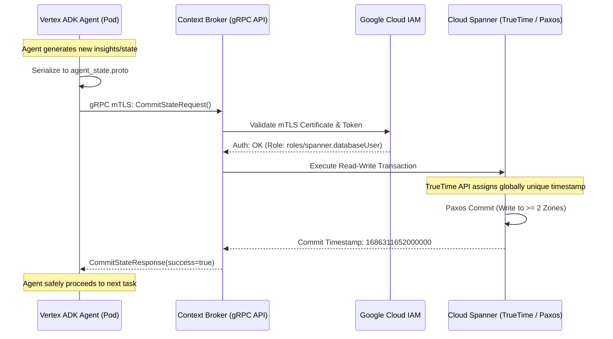

# Decoupling Agentic Swarms: Why In-Memory Quorum is a Distributed Nightmare and How Google Cloud Spanner Solves It

*By Abhishek Khaparde*

As the adoption of large language models (LLMs) moves beyond simple chatbot interfaces and into the realm of autonomous, multi-agent swarms, architectural complexity is skyrocketing. We are no longer building systems where a single query yields a single response. We are building asynchronous, event-driven meshes where dozens of specialized agents—researchers, planners, coders, and critics—collaborate to solve massive, multi-step problems. 

In this new paradigm, state management is the single most critical bottleneck. How do agents know what the other agents have done? How do they avoid duplicating work? How do they recover if a node crashes mid-thought?

In the rush to build these systems, a highly toxic anti-pattern has emerged in the open-source community: attempting to embed consensus protocols (like Raft or Paxos) directly into the memory space of ephemeral agent pods. In this deep dive, we will explore why this approach leads to catastrophic failures at scale, and how we can architect a fundamentally superior solution using the Vertex Agent Development Kit (ADK) paired with Google Cloud Spanner.

---

## The Anti-Pattern: In-Memory Quorum in Ephemeral Pods

To understand the problem, we must first look at how many modern agentic frameworks are being constructed. Developers, recognizing the need for shared state among a swarm of agents, often reach for embedded consensus libraries. They attempt to turn the agent pods themselves into a stateful Raft cluster.

### 1. The Ephemerality Contradiction

Raft and Paxos are designed for relatively stable infrastructure. They assume that nodes might fail, but that the overall cluster membership is somewhat static. Agent pods in a Kubernetes environment (like GKE) are the exact opposite. They are highly ephemeral. They scale up rapidly when a massive task is dispatched and scale down to zero when idle. They are evicted, preempted, and rescheduled constantly.

When you embed a Raft node inside an ephemeral agent pod, every time an agent spins up or dies, the cluster must undergo a membership change. If a large task completes and the autoscaler terminates 50% of the agent pods simultaneously, the remaining pods lose quorum. The swarm cannot elect a leader. It cannot commit new state. The entire multi-agent system enters a deadlock, frozen in time, unable to make progress until manual intervention occurs or enough pods randomly spin back up to achieve quorum.

### 2. The Split-Brain Catastrophe

Network partitions are inevitable in distributed systems. When a network partition occurs in an embedded Raft cluster of agent pods, you risk a split-brain scenario. If the swarm is partitioned into two halves, neither half may have a majority. Alternatively, if misconfigured, both halves might elect a leader. 

If Agent A (in partition 1) and Agent B (in partition 2) both believe they have the lock to update the global conversation context, they will both proceed to call the LLM API, perform expensive computations, and write conflicting state. When the partition heals, the swarm's memory is hopelessly corrupted. The agents hallucinate based on conflicting realities.

### 3. Unbounded Memory Bloat and OOM Kills

Embedded consensus requires each node to maintain a copy of the state machine's log. In a multi-agent swarm, the "state" includes entire conversation histories, scratchpads, intermediate code generation, and vast JSON payloads. 

If this log is kept in memory, the memory footprint of every agent pod grows unboundedly as the task progresses. Eventually, the Kubernetes Out-Of-Memory (OOM) killer intervenes. It terminates the pod. As pods are killed, quorum is lost, and the system collapses.

---

## The Solution: Stateless Compute, Stateful Storage

The fundamental principle of robust cloud-native architecture is the separation of compute and storage. Agentic swarms must adhere to this rule. The agent pods must be 100% stateless. They should contain nothing more than the application binary, the Vertex ADK runtime, and ephemeral, highly-scoped working memory.

All shared context, session history, and inter-agent communication must be externalized. But it cannot be externalized to just any database. It requires a database capable of handling massive concurrency, strict serializability, and global consistency. It requires Google Cloud Spanner.

### Architecting the Vertex ADK Mesh with Spanner

In our modernized topology, we utilize the Vertex Agent Development Kit (ADK) to build the cognitive logic of the agents. However, we intercept the ADK's default memory management and redirect it to a dedicated gRPC layer.

When an agent needs to update the swarm's shared context, it serializes its intent and data payload into a strict Protocol Buffer (`agent_state.proto`). This Protobuf is then streamed over an mTLS-encrypted gRPC connection to a stateless microservice layer (the Context Broker), which in turn executes the transaction against Cloud Spanner.

This architecture fundamentally alters the failure domain. If an agent pod crashes mid-execution, it doesn't matter. The pod is stateless. A new pod spins up, reads the latest strictly-consistent state from Spanner, and resumes the work exactly where the previous pod left off. There is no quorum to lose. There is no split-brain.

### The Role of Google Cloud Spanner and TrueTime

Why Spanner? Why not a standard relational database or a NoSQL document store? 

Multi-agent swarms generate incredibly dense, concurrent write patterns. Dozens of agents might attempt to update the same conversation context simultaneously. A standard NoSQL store offering eventual consistency will result in race conditions. Agent A will overwrite Agent B's contribution because Agent A's read was stale. 

Spanner provides *external consistency* (strict serializability) at global scale. It achieves this using Google's TrueTime API—a highly synchronized global clock system relying on GPS and atomic clocks in Google's data centers.

When our ADK agents commit state via gRPC, Spanner utilizes TrueTime to assign an absolutely guaranteed, globally monotonic timestamp to that transaction. Under the hood, Spanner's own highly optimized Paxos implementation handles the replication across storage shards. The consensus is removed from our fragile agent pods and delegated to Google's hardened, purpose-built storage infrastructure.

---

## Architectural Topology: The gRPC mTLS Flow

Below is a detailed sequence and architectural diagram illustrating the secure, stateless flow of information from the ephemeral agent pods down to the Spanner Paxos backend.

### The Anatomy of the Network Request

1. **Serialization:** The ADK agent encapsulates its state (e.g., `sequence_number`, `internal_state`, `current_intent`) into a structured Protobuf message. This guarantees schema validation before the data ever leaves the pod.
2. **mTLS Transport:** The request is sent over gRPC using mutual TLS. Both the agent pod and the Context Broker authenticate each other using certificates issued by Google Certificate Authority Service (CAS). This ensures zero-trust security; even if the internal Kubernetes network is compromised, the state payload is encrypted and authenticated.
3. **Transaction Execution:** The Context Broker opens a read-write transaction with Spanner. It reads the current state, applies the agent's delta, and attempts to commit.
4. **TrueTime and Paxos:** Spanner assigns a TrueTime timestamp. It then replicates the write across its Paxos voting replicas (which are physically distributed across multiple availability zones or regions). Once a majority of replicas acknowledge the write, the transaction commits.
5. **Exponential Backoff:** If the network partitions or a transient error occurs during this flow, the agent's gRPC client (as demonstrated in `agent_spanner_client.py`) catches the exception and executes an exponential backoff with jitter. Because the agent itself is stateless, it can safely retry the operation indefinitely without corrupting a local consensus log.

---

## Conclusion

Building autonomous agent swarms is complex enough without introducing the immense operational burden of managing distributed consensus within your compute layer. 

By recognizing the anti-pattern of in-memory quorum and migrating to a decoupled architecture utilizing the Vertex ADK, gRPC, and Google Cloud Spanner, we achieve a highly resilient, infinitely scalable mesh. Our compute pods can scale from zero to a thousand and back to zero in seconds without risking state corruption or deadlocks. The cognitive logic remains in the application layer, while the brutal reality of distributed state management is securely outsourced to Spanner’s TrueTime infrastructure. 

This is the path to production-grade Agentic AI.
