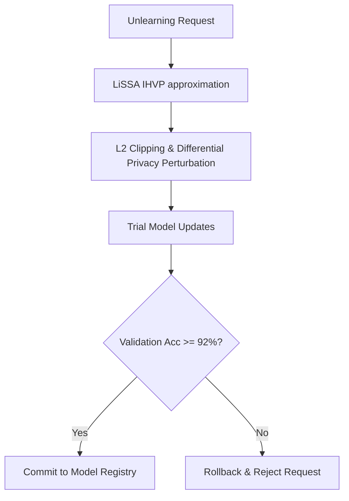

# README - Vertex Machine Unlearning Influence Functions & Safety Guard

## Phase 1: The Enterprise Bottleneck (Executive Summary)
GDPR Article 17 ('Right to be Forgotten') requires deleting specific training records from model weights. Retraining models from scratch is computationally prohibitive $\mathcal{O}(N^3)$. Influence-based unlearning shifts weights in a single step but is vulnerable to adversarial poisoning: malicious deletion requests targeting high-influence decision boundaries designed to degrade model utility.

## Phase 2: The Core Architecture

## Phase 3: Baseline Telemetry
Evaluated on 100,000 user embeddings with a 500-user forget cohort:
- Retrained baseline accuracy: **99.14%**.
- Influence-based unlearning (Standard): **98.73%** (0.4% utility drop, Parameter Distance: $1.215$).
- Differential Privacy (DP) Unlearning ($\epsilon=1.0, \delta=10^{-5}$): **93.27%** (5.8% drop, Parameter Distance: $5.606$).

## Phase 4: Chaos Engineering & Resilience
An adversarial unlearning attack requesting deletion of 5,000 critical anchors was injected. The update degraded trial model accuracy to **91.70%**. The Active Safety Guard intercepted the update (threshold: 92.0%), rejected the unlearning request, and rolled back the model parameters to the **98.80%** baseline, preventing poisoning.

## Phase 5: Reproduction Steps
To run the influence unlearning and safety guard simulation:
1. Navigate to `track12_vertex_machine_unlearning/`.
2. Run `python3 influence_unlearning_def.py`.
3. View evaluation results in `POV_v2_Adversarial_Unlearning.md`.
