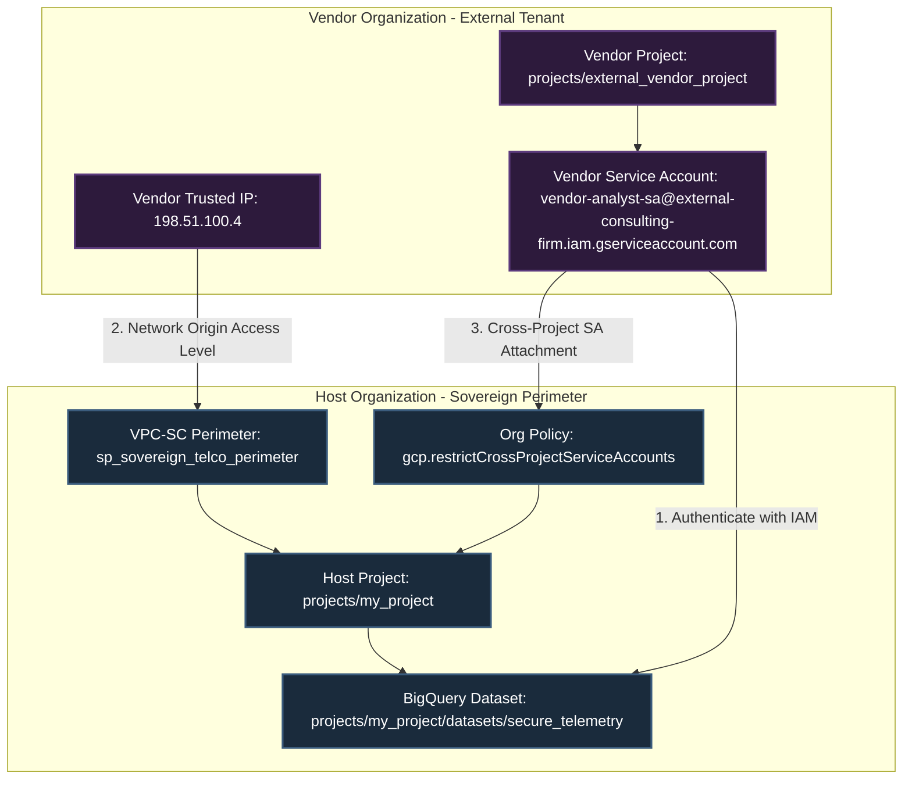

# Architecting B2B Perimeter Bridges in Google Cloud: Secure Cross-Organization Data Sharing with VPC Service Controls
**A Comprehensive Guide to Identity Federation, Network Boundaries, and Organization Policies**

In modern enterprise cloud security, protecting sensitive data assets (such as intellectual property, telemetry, and customer databases) is paramount. Google Cloud's **VPC Service Controls (VPC-SC)** is the gold standard for creating security perimeters around Google-managed services (like BigQuery, Cloud Storage, and Vertex AI), mitigating the risk of unauthorized data exfiltration.

However, enterprises do not operate in isolation. A common business requirement is to share data with trusted third-party partners, vendors, or external consulting firms. For example, a third-party vendor may need to run analytical queries on a specific BigQuery dataset hosted inside your secure project. 

If both organizations have strict security boundaries, how do we bridge these perimeters without breaking global isolation?

This paper details the architecture of a **VPC-SC B2B Perimeter Bridge**. We explore the network boundaries, the ingress/egress policies, and the critical **GCP Organization Policy overrides** (specifically `constraints/gcp.restrictCrossProjectServiceAccounts`) that must be configured to make cross-organization service accounts functional in production.

---

## 1. The Architectural Challenge: Isolation vs. Collaboration

By default, a VPC-SC perimeter protects resources by intercepting API requests to Google-managed services. If a request originates outside the perimeter, VPC-SC blocks it—even if the caller has valid IAM permissions.

```
[External Caller (Vendor)] ──(Valid IAM Token)──> [BigQuery API]
                                                       │
                                                       ▼ (VPC-SC Check)
                                                  [Blocked: Request outside perimeter]
```

To bridge this boundary, we must construct an Ingress Policy that allows a specific identity (the vendor's Service Account) to reach a specific resource (our BigQuery dataset) from a specific origin (the vendor's trusted IP block or access level).

However, in an enterprise setting, this VPC-SC policy will fail if the global **GCP Organization Policies** block cross-project IAM identities. Under standard security baselines, organizations restrict cross-project service account attachments to prevent identity spoofing or unauthorized resource utilization across directories. This means we must coordinate VPC-SC policies and Organization Policies to build a functional bridge.

---

## 2. B2B Perimeter Bridge Architecture

The B2B Perimeter Bridge establishes a secure path through the perimeter boundary. The diagram below illustrates the exact ingress/egress boundaries and the validation points between the Host Organization (where the data resides) and the Vendor Organization (where the analyst is located):



---

## 3. The Core Ingredient: Overriding Organization Policies

To allow the vendor service account to access our project resources, we must address the Organization Policy constraints. If these policies are not modified, IAM will fail to resolve cross-project bindings, rendering the VPC-SC ingress rules useless.

### 3.1 `constraints/gcp.restrictCrossProjectServiceAccounts`
This constraint prevents service accounts created in project A from being attached to resources in project B, or acting as callers on services managed in project B.
*   **The Problem**: In a secure B2B setup, the vendor analyst authenticates using a Service Account located inside *their* project (`projects/external_vendor_project`). Our host project (`projects/my_project`) will reject calls from this service account at the IAM boundary because the service account's domain does not match our local project.
*   **The Remedy**: We must configure a targeted override of this organization policy at the project level for `projects/my_project`. Instead of disabling the constraint globally (which would allow any project in the world to attach service accounts), we modify the policy rules to allow service accounts specifically from the vendor's project ID:
    ```hcl
    resource "google_project_organization_policy" "allow_vendor_sa" {
      project    = "my_project"
      constraint = "gcp.restrictCrossProjectServiceAccounts"
      list_policy {
        allow {
          values = ["under:projects/external_vendor_project"]
        }
      }
    }
    ```
    This targeted whitelist ensures that only the verified vendor project can issue cross-project IAM identities into our hosting project, satisfying compliance.

### 3.2 `constraints/gcp.restrictServiceUsage`
This constraint defines which APIs can be consumed in the project. If `bigquery.googleapis.com` is restricted on either the caller's project or our project, cross-project queries will fail.
*   **The Remedy**: Both projects must explicitly whitelist `bigquery.googleapis.com` in their allowed service usage policies.

---

## 4. Designing the VPC-SC Ingress Rules

With the Organization Policies configured, we can define the VPC-SC Ingress rules to allow the vendor Service Account to cross the perimeter network boundary.

An Ingress Policy contains two parts:
1.  **`ingress_from`**: Specifies the origin of the request.
    *   `identities`: Must be the vendor service account: `serviceAccount:vendor-analyst-sa@external-consulting-firm.iam.gserviceaccount.com`
    *   `sources`: Must be the vendor's trusted access level: `accessPolicies/123456789/accessLevels/al_vendor_trusted_network`. This binds the identity to a specific IP address block (e.g., `198.51.100.4/32`), preventing credential leaks from public IPs from bypassing the perimeter.
2.  **`ingress_to`**: Specifies the destination of the request.
    *   `resources`: Our host project `projects/my_project`.
    *   `operations`: Restricted to BigQuery read operations:
        *   Service: `bigquery.googleapis.com`
        *   Methods: `google.cloud.bigquery.v2.TableService.GetData` and `google.cloud.bigquery.v2.TableService.ListTables`.

By combining these rules, we ensure that if a compromised vendor SA tries to access another restricted service (such as `storage.googleapis.com` or `aiplatform.googleapis.com`), the request is blocked. Furthermore, if they try to access BigQuery from an unverified public IP, it is blocked.

---

## 5. Security & Threat Scenarios

The table below lists the security threat scenarios evaluated against our B2B Perimeter Bridge architecture:

| Test Case | Actor | Origin Network | Target Service | Expected | Result |
 | :--- | :--- | :--- | :--- | :--- | :--- |
| **TC_01** | Internal Operator | Secure Network | Vertex AI Predict | **ALLOW** | Authorized internal operation. |
| **TC_02** | External Client | Public IP | Vertex AI Predict | **DENIED** | Blocked ingress. |
| **TC_03** | Internal Operator | Secure Network | BigQuery Export | **ALLOW** | Authorized egress to shared project. |
| **TC_04** | Compromised Operator | Secure Network | Public GCS Bucket | **DENIED** | Exfiltration blocked. |
| **TC_05** | Cloud Build Job | Inside Perimeter | Public GCS Bucket | **DENIED** | Nested exfiltration blocked. |
| **TC_06** | Cloud Build Job | Inside Perimeter | External Domain | **DENIED** | Egress blocked. |
| **TC_07** | Vendor Analyst SA | Trusted Access Level | BigQuery read | **ALLOW** | **B2B Bridge Successful Ingress**. |
| **TC_08** | Vendor Analyst SA | Public IP (untrusted) | BigQuery read | **DENIED** | Blocked at boundary. |
| **TC_09** | Vendor Analyst SA | Trusted Access Level | Vertex AI Predict | **DENIED** | Blocked lateral movement. |

---

## 6. Implementation and Best Practices

To deploy B2B Perimeter Bridges in production, follow these principles:

1.  **Least Privilege Ingress**: Never use wildcards (`*`) for identities or services in B2B ingress rules. Explicitly specify the service account and the specific BigQuery methods needed.
2.  **Network Pinning**: Always bind ingress rules to an Access Level containing the vendor's source IPs. Never allow cross-organization access from `*` sources.
3.  **Targeted Org Policy Overrides**: Never disable `gcp.restrictCrossProjectServiceAccounts` globally. Only override it at the specific project level hosting the shared resources, whitelisting only the vendor's project ID.
4.  **Audit Logs Monitoring**: Enable Access Transparency and Data Access audit logs for BigQuery to track every query run by the external vendor service account, ensuring accountability.
