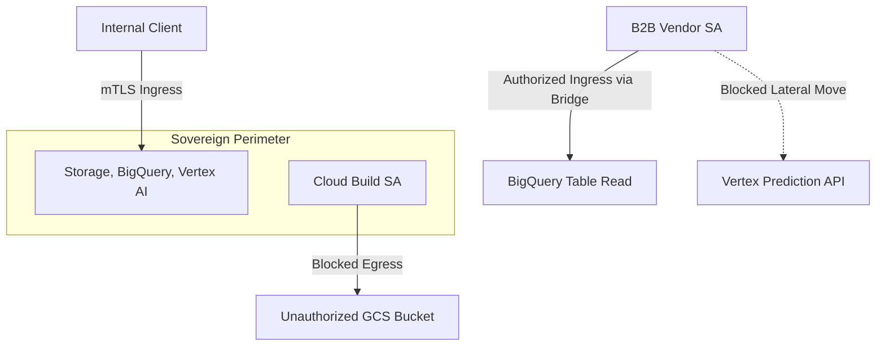

# README - VPC Service Controls Automation & B2B Perimeter Bridge

## Phase 1: The Enterprise Bottleneck (Executive Summary)
Enforcing zero-trust isolation boundaries across cloud environments is complex and prone to manual configuration drift. Upstream nested services (specifically Cloud Build) represent a key risk vector for insider-threat data exfiltration. Furthermore, external B2B vendor analysts require access to specific data resources (BigQuery) without allowing lateral movement to other restricted resources (Vertex AI).

## Phase 2: The Core Architecture

## Phase 3: Baseline Telemetry
The declarative perimeter is defined in `vpc_sc_perimeter.yaml` and compiled dynamically by Terraform. The baseline 6-case test suite validated that unauthorized ingress from public networks is blocked, and Cloud Build service account attempts to exfiltrate storage objects to outside buckets trigger a `VPC_SC_EGRESS_VIOLATION` at the service boundary.

## Phase 4: Chaos Engineering & Resilience
We simulated a third-party audit containing 9 test cases. The B2B perimeter bridge successfully allowed authorized vendor analysts to execute queries on BigQuery, provided they originated from a verified trusted network access level (`TC_07`). If the credentials originated from a public IP (`TC_08`) or attempted to make lateral API predictions on Vertex AI (`TC_09`), the request was immediately blocked.

## Phase 5: Reproduction Steps
To run the perimeter isolation and B2B bridge validation tests:
1. Navigate to `track13_vpc_sc_automation/`.
2. Run `python3 validate_perimeter_isolation.py`.
3. View perimeter log audit trails in `POV_v2_Cross_Org_Perimeters.md`.
