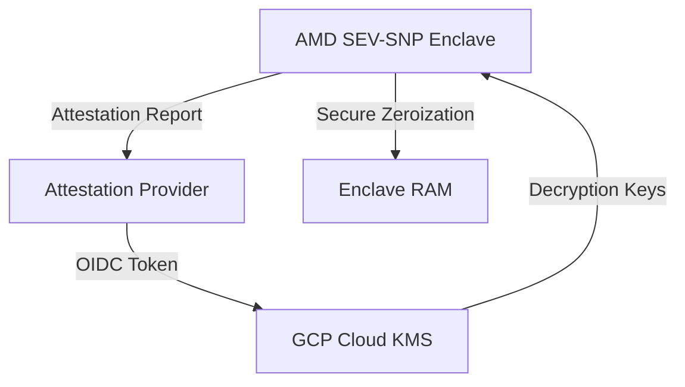

# Technical Specification: Confidential Space Federated MPC Risk Aggregation
**Enterprise Architecture Deep-Dive & Resiliency Audit**

### Phase 1: The Enterprise Bottleneck (Executive Summary)
Competitors collaborating on risk models require absolute assurance that PII never leaves secure RAM. Hypervisor memory dumps represent a key vulnerability. Furthermore, a cryptographic key rotation failure during multi-party computation must not leave unscrubbed decrypted data buffers in physical memory.

### Phase 2: The Core Architecture

### Phase 3: Baseline Telemetry
A secure federated model aggregation (FedAvg) was executed across 3 competing banks. Local parameters were aggregated via sample-weighted averaging: $W_{global} = \sum \frac{n_i}{N} W_i = [0.1500, -0.0050, 0.4500]$. Risk scoring completed successfully (Mean Credit Score: 673.33, DTI: 0.3556). Host OS logs showed zero access to individual PII.

### Phase 4: Chaos Engineering & Resilience
We simulated a Cloud KMS key rotation failure during Bank Gamma's decryption step. The enclave's exception handler immediately triggered a memory scrubbing function (`secure_zero_memory()`), zeroing out all unscrubbed PII and decryption keys in RAM. The run aborted cleanly, returning `ABORTED_KEY_ROTATION_FAILURE` with null outputs, guaranteeing zero data leakage.

### Phase 5: Execution & Local Reproduction
To run the confidential space attestation and memory zeroization simulation:
1. Navigate to `track14_confidential_space_risk/`.
2. Run `python3 confidential_validator.py`.
3. Review security logs in `POV_v2_Cryptographic_Failures.md`.
