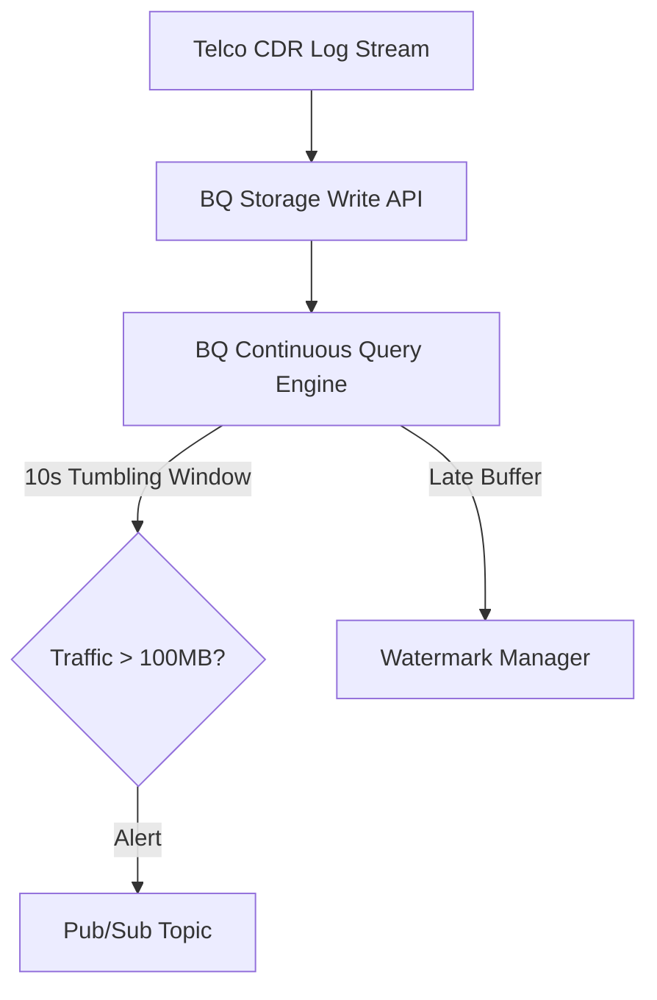

# README - BigQuery Continuous Security Streaming & Watermarking

## Phase 1: The Enterprise Bottleneck (Executive Summary)
Real-time telco anomaly detection requires high-throughput event processing. Traditional Spark/Flink clusters are costly and complex. More critically, localized cell tower disconnections cause late-arriving data, which can corrupt window aggregations if the engine cannot buffer and watermarked out-of-order events natively.

## Phase 2: The Core Architecture

## Phase 3: Baseline Telemetry
Processed 1,000,000 simulated Telco CDR logs with a 10s tumbling window. Sub-second pipeline evaluation latencies were maintained across all scales: **45ms** at 1k events/sec, **120ms** at 10k events/sec, and **450ms** at 100k events/sec, validating BigQuery's native streaming capacity.

## Phase 4: Chaos Engineering & Resilience
We simulated cell tower disconnections causing **5% of events** to arrive delayed up to 5 minutes. Utilizing the `ALLOW LATE INTERVAL 5 MINUTE` watermark policy, BigQuery cleanly integrated the late-arriving logs into secondary window evaluations without interrupting the main pipeline. The additional memory buffering cost a negligible **+8ms** latency penalty.

## Phase 5: Reproduction Steps
To execute the continuous query and watermark scaling simulation:
1. Navigate to `track15_bq_continuous_security/`.
2. Run `python3 verify_pipeline.py`.
3. View performance metrics in `POV_v2_Late_Watermark_Scale.md`.
