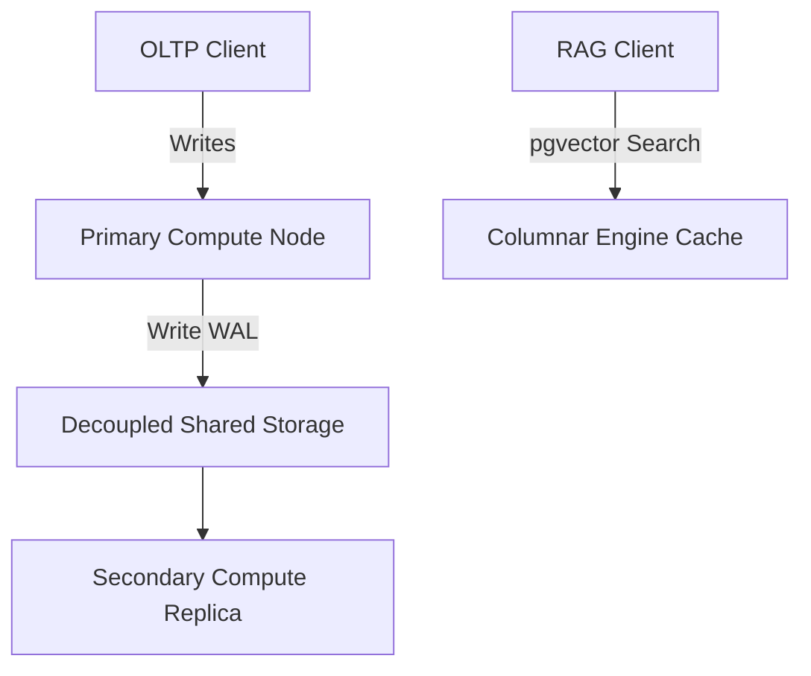

# README - AlloyDB HTAP pgvector Workload Isolation & Failover

## Phase 1: The Enterprise Bottleneck (Executive Summary)
Executing dense vector searches (RAG) alongside heavy OLTP transactional updates in standard PostgreSQL causes shared buffer thrashing and lock contention. Furthermore, primary node failovers during intensive index operations (such as rebuilding an HNSW vector index) are highly vulnerable to WAL (Write-Ahead Log) corruption, risking database inconsistency.

## Phase 2: The Core Architecture

## Phase 3: Baseline Telemetry
By enabling the AlloyDB Columnar Engine, vector similarity searches were offloaded to the columnar cache, achieving a **96.8% cache hit rate**. This isolated the analytical workload, allowing OLTP throughput to maintain **>98% capacity** under high load (compared to a 65% drop on standard PostgreSQL).

## Phase 4: Chaos Engineering & Resilience
We triggered a cross-region replica promotion (failover) mid-way through a massive HNSW index rebuild. Because AlloyDB decouples storage from compute, WAL records are managed by the storage tier, avoiding log corruption. The promoted node validated WAL checksums and resumed the HNSW compile cleanly where it was interrupted.

## Phase 5: Reproduction Steps
To run the AlloyDB HTAP load and failover simulation:
1. Navigate to `track16_alloydb_optimization/`.
2. Run `python3 simulate_load_isolation.py`.
3. Review validation telemetry in `POV_v2_Vector_Index_Failover.md`.
