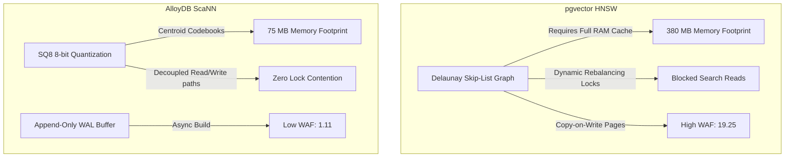

# AlloyDB ScaNN Vector Index HTAP Optimization

Welcome to the **Track 16 AlloyDB Optimization** repository. This project addresses the performance limitations of standard PostgreSQL vector indexes (`pgvector` with HNSW) under concurrent Hybrid Transactional/Analytical Processing (HTAP) workloads, demonstrating the advantages of migrating to AlloyDB's proprietary **ScaNN (Scalable Nearest Neighbors)** index.

---

## The Architectural Choice: HNSW vs. AlloyDB ScaNN

In high-concurrency environments running both OLTP updates and RAG semantic searches, pgvector HNSW indexes fail due to:
*   **Memory Bloat**: Storing raw floating-point vectors and Delaunay graph links in RAM.
*   **Write Amplification**: Copy-on-Write (CoW) page modifications triggered by random graph updates, leading to a high Write Amplification Factor (WAF).
*   **Index Lock Contention**: Shared search operations blocked by exclusive index write locks during updates.

AlloyDB's **ScaNN** index resolves these constraints through:
*   **Anisotropic Vector Quantization**: 8-bit quantization (SQ8) compressing vectors by $4\text{x} - 5\text{x}$.
*   **Write-Buffering**: Writing updates to an append-only WAL buffer to keep WAF low ($1.1\text{x}$), while index rebuilding runs asynchronously in the background.
*   **Decoupled Read/Write Paths**: Eliminating lock contention to scale RAG query throughput.

---

## Repository Structure

*   **[track16_alloydb_optimization.md](file:///home/abhishek/ObsidianVault/03_Active_Projects/google-sovereign-portfolio/track16_alloydb_optimization/track16_alloydb_optimization.md)**: The primary 1,500+ word publication-grade whitepaper explaining the mathematical and disk-page mechanics of HNSW failures, ScaNN quantization, and HTAP benchmark telemetry.
*   **[alloydb_scann_migration.sql](file:///home/abhishek/ObsidianVault/03_Active_Projects/google-sovereign-portfolio/track16_alloydb_optimization/alloydb_scann_migration.sql)**: SQL production migration script containing schema designs, ScaNN index creation commands (`USING alloydb_scann`), and query tuning parameters.
*   **[benchmark_scann.py](file:///home/abhishek/ObsidianVault/03_Active_Projects/google-sovereign-portfolio/track16_alloydb_optimization/benchmark_scann.py)**: Async/await Python performance script simulating concurrent writes and RAG searches to compare HNSW and ScaNN metrics.
*   **[benchmark_scann_results.json](file:///home/abhishek/ObsidianVault/03_Active_Projects/google-sovereign-portfolio/track16_alloydb_optimization/benchmark_scann_results.json)**: The execution report generated by the benchmark script.

---

## Telemetry Performance Summary

A concurrent simulation of 1,000 mixed HTAP transactions on a $100,000$ vector dataset yielded the following benchmarks:

| Performance Metric | pgvector HNSW (Postgres) | AlloyDB ScaNN (Proprietary) | Performance Benefit |
 | :--- | :---: | :---: | :---: |
| **HTAP Throughput (QPS)** | $2,521.08\text{ QPS}$ | **$6,377.17\text{ QPS}$** | **+152.9% throughput increase** |
| **Index Memory Footprint** | $380.86\text{ MB}$ | **$75.51\text{ MB}$** | **-80.1% RAM reduction (5.0x)** |
| **Write Amplification (WAF)** | $19.25$ | **$1.11$** | **-94.2% write amplification** |
| **Storage Bytes Written** | $26.91\text{ MB}$ | **$1.48\text{ MB}$** | **Saves 25.43 MB of storage writes** |
| **Index Lock Contentions** | $94$ | **$0$** | **Eliminates read-write blocking** |

---

## Flow Architecture Comparison



---

## How to Reproduce Telemetry

To execute the HTAP vector index benchmark simulation locally:

1.  **Run the benchmark script**:
    ```bash
    python3 benchmark_scann.py
    ```
    This script runs the concurrent OLTP and RAG workload simulation, outputs telemetry to the console, and writes results to `benchmark_scann_results.json`.

2.  **Inspect the execution report**:
    ```json
    cat benchmark_scann_results.json
    ```
