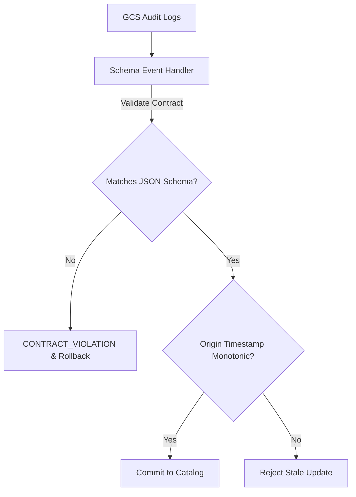

# Technical Specification: Metadata Catalog Active Data Contracts & Collision Resolution
**Enterprise Architecture Deep-Dive & Resiliency Audit**

### Phase 1: The Enterprise Bottleneck (Executive Summary)
Schema drift in federated data meshes causes severe downstream problems, specifically triggering data hallucinations in AI agents. Additionally, simultaneous updates to the catalog from different domain teams can cause semantic collisions, where late-arriving out-of-order webhooks overwrite new schema versions with stale ones.

### Phase 2: The Core Architecture

### Phase 3: Baseline Telemetry
Data contracts are defined as JSON schemas. Upstream schema drift was detected in real-time by trapping audit log events (e.g., `TableService.UpdateTable`). Dropping a column raised a `CONTRACT_VIOLATION` exception, automatically blocking ingestion and triggering a rollback of the upstream migration.

### Phase 4: Chaos Engineering & Resilience
We simulated network latency causing out-of-order schema updates. The catalog asserted event-origin monotonicity using a Last-Writer-Wins (LWW) resolution based on the audit log's UTC event timestamp. Stale, delayed events were rejected, preventing semantic collisions and ensuring eventual catalog consistency.

### Phase 5: Execution & Local Reproduction
To run the active data contracts and concurrency resolution tests:
1. Navigate to `track17_metadata_knowledge_catalog/`.
2. Run `python3 test_event_handler.py`.
3. View audit diagnostics in `POV_v2_Semantic_Collisions.md`.
