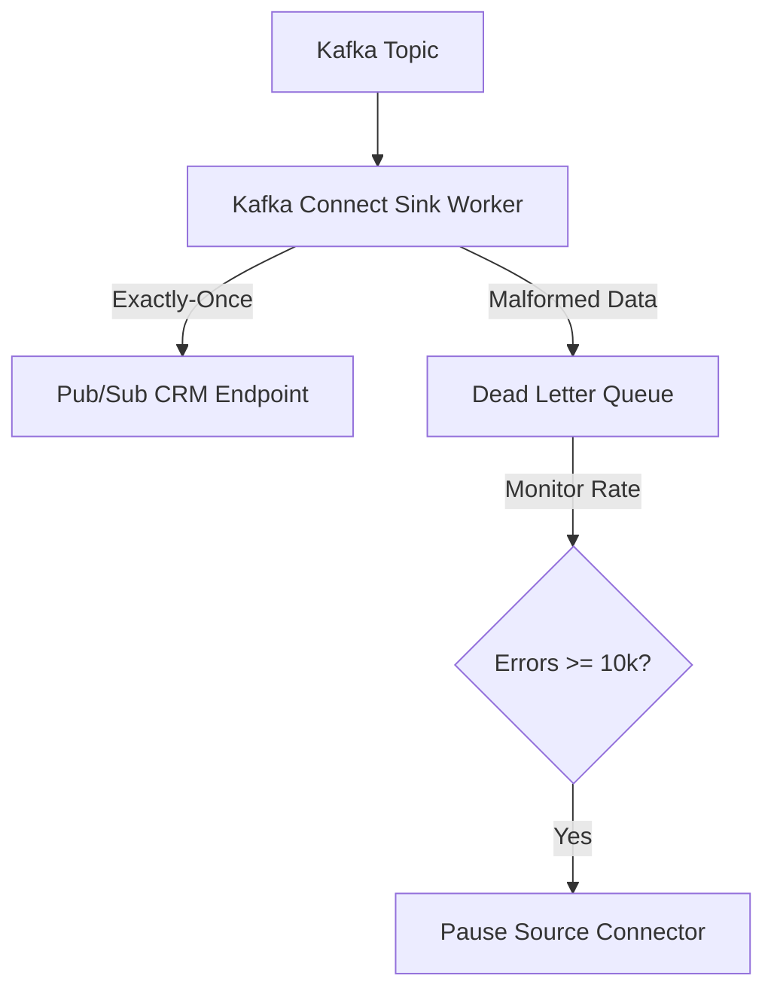

# README - Confluent Event-Driven CRM & DLQ Backpressure

## Phase 1: The Enterprise Bottleneck (Executive Summary)
Reverse ETL synchronizing analytical predictions back to CRM platforms requires exactly-once semantics to prevent duplicate actions. During high-throughput bursts, data anomalies are routed to a Dead-Letter Queue (DLQ). However, a systemic upstream failure can overflow the DLQ, triggering broker I/O bottlenecks that crash Connect worker nodes.

## Phase 2: The Core Architecture

## Phase 3: Baseline Telemetry
A burst of 100,000 events was processed with exactly-once settings (`read_committed` isolation). Ingestion speeds reached **~900k msg/s**. When a 5% error rate was injected, 5,000 malformed messages were cleanly routed to the DLQ, allowing the other 95,000 valid messages to commit without delay.

## Phase 4: Chaos Engineering & Resilience
Under a massive barrage of 50,000 corrupted events, a circuit breaker was triggered at **10,000 continuous errors** (the max DLQ capacity). To protect Connect worker node RAM and I/O from overloading, the system asserted backpressure, pausing the source connector to prevent a cascading crash.

## Phase 5: Reproduction Steps
To execute the exactly-once Kafka Connect and DLQ backpressure test:
1. Navigate to `track18_reverse_etl_confluent/`.
2. Run `python3 test_topology.py`.
3. Review backpressure event logging in `POV_v2_DLQ_Backpressure.md`.
