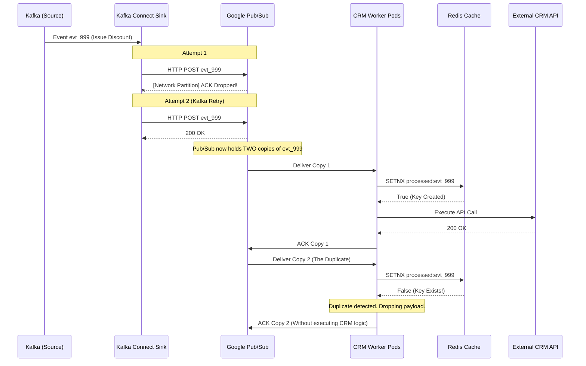

# Bridging the Abyss: Solving the Exactly-Once Impedance Mismatch in Reverse ETL Pipelines

*By Abhishek Khaparde, Principal Streaming Architect*

In modern enterprise data architectures, the flow of data is no longer a one-way street ending in a data warehouse. We have entered the era of **Reverse ETL**. We run complex predictive machine learning models in our analytical clusters—calculating churn probabilities, dynamic pricing optimizations, and personalized recommendations—and we must rapidly sync those insights back into operational systems like Salesforce, Marketo, or custom CRM microservices. 

To achieve this at scale, architectures heavily rely on Confluent Kafka to stream these calculated events. However, a massive architectural blind spot exists when transitioning data across different distributed messaging systems. Specifically, a critical failure occurs when bridging the rigid, stateful environment of Kafka to the highly scalable, but stateless, environment of Google Cloud Pub/Sub.

This phenomenon is what I call the **Exactly-Once Impedance Mismatch**. If left unaddressed, it leads to catastrophic business outcomes: customers receiving the same retention discount code five times, accounts being billed redundantly, and API rate limits being completely decimated during network storms.

In this deep dive, we will unpack why this mismatch occurs, the mechanics of a network retry storm, and how we can architect an impenetrable deduplication layer using the atomic operations of Redis to restore true exactly-once semantics.

---

## 1. The Anatomy of the Impedance Mismatch

To understand the problem, we must look at the guarantees provided by the two streaming systems independently, and what happens when they collide.

### The Kafka Domain: Exactly-Once Semantics (EOS)
Within a closed Kafka ecosystem, achieving Exactly-Once Semantics (EOS) is a solved problem. Kafka utilizes a combination of idempotent producers (which assign sequence numbers to messages to prevent duplicate appends) and a transactional API. When a Kafka Connect sink worker processes a batch of analytical insights, it reads the data, processes it, and commits the consumer offsets back to Kafka in a single, atomic transaction. If the worker crashes mid-batch, the transaction aborts, the offsets are not advanced, and a new worker safely re-reads the exact same batch.

### The Pub/Sub Domain: At-Least-Once Delivery
Google Cloud Pub/Sub is architected differently. It is designed for unparalleled global scalability and throughput without the need to manage partitions. To achieve this, it relaxes its delivery guarantees. Pub/Sub operates strictly on an **At-Least-Once** delivery model. 

When a consumer pulls a message from a Pub/Sub subscription, it must explicitly send an acknowledgment (ACK) back to the broker. If the broker does not receive the ACK within a specified deadline, it assumes the consumer died and redelivers the message to another consumer.

### The Collision
The Reverse ETL pipeline breaks at the integration boundary. 

1. The analytical engine pushes a retention offer event to a Kafka topic.
2. A Kafka Connect Sink worker reads the event.
3. The worker successfully publishes the event over HTTP to a Google Cloud Pub/Sub topic.
4. *A transient network blip causes the HTTP acknowledgment from Pub/Sub back to Kafka Connect to drop.*

From Kafka Connect's perspective, the publish failed. Because it guarantees exactly-once processing on its end, it does the correct thing: it retries. It publishes the exact same event to Pub/Sub again. 

From Pub/Sub's perspective, these are two entirely distinct messages. It gladly accepts both. The impedance mismatch has birthed a duplicate. 

When the final CRM ingestion worker pulls from Pub/Sub, it will receive the event twice. Because Pub/Sub itself can also experience internal network partitions resulting in dropped ACKs from the worker, Pub/Sub might redeliver the event a third or fourth time. This is a **Retry Storm**.

---

## 2. Architecting the Idempotent Boundary

We cannot change the fundamental physics of network unreliability, nor can we change Pub/Sub's at-least-once architecture. Therefore, we must architect a defensive boundary at the very edge of our pipeline: inside the CRM ingestion worker.

We must make the worker **idempotent**. An idempotent operation is one that can be applied multiple times without changing the result beyond the initial application. No matter how many times Pub/Sub delivers event `evt_123`, the CRM API must only be called once.

To achieve this at high throughput, we require a fast, atomic, shared state store. A relational database like PostgreSQL can do this via `UNIQUE` constraints, but at a severe cost to I/O and connection overhead. Instead, we utilize an in-memory data structure store: **Redis**.

### The Redis SETNX Operation

Redis is fundamentally single-threaded. This design choice is its superpower when it comes to distributed concurrency control. It provides an operation called `SETNX` (Set if Not Exists).

When the CRM worker receives a payload, it extracts a deterministic, unique identifier generated by the source system (the `message_id`). Before executing any business logic, the worker issues a `SETNX` command to Redis using the `message_id` as the key.

Because Redis executes commands sequentially, the operation is strictly atomic. 
- If the key does not exist in Redis, the `SETNX` command succeeds, writes the key, and returns `1` (True). The worker proceeds.
- If a duplicate message arrives milliseconds later (even processed by a completely different worker pod in another availability zone), its `SETNX` command will fail because the key now exists. It returns `0` (False). The worker instantly drops the duplicate payload.

---

## 3. Pipeline Topology

Below is a sequence diagram illustrating the end-to-end architecture, highlighting where the impedance mismatch generates the duplicate, and how the Redis layer neutralizes it.

---

## 4. Operational Considerations for the Cache

While the `SETNX` approach is elegant, implementing it in production requires specific operational safeguards to prevent the Redis cluster from failing.

### TTL (Time-To-Live) Management
If we blindly insert every `message_id` into Redis, the memory will grow unboundedly until the cache experiences an Out-Of-Memory (OOM) crash, taking down the entire ingestion pipeline.

Every `SETNX` operation must be paired with an expiration (TTL). The duration of the TTL should exceed the maximum possible delivery retry window of the queuing system. For Google Cloud Pub/Sub, message retention is configurable but defaults to 7 days. Setting a Redis TTL of 24 to 48 hours is usually sufficient to catch network retry storms while allowing old keys to be passively evicted by Redis, keeping memory utilization flat.

### Failure Handling
What happens if the Redis cluster itself goes offline? 

The pipeline must fail closed. If the worker cannot connect to Redis to verify the uniqueness of the message, it must crash or pause consumption. If it fails open (bypassing the check), it will flood the CRM with duplicates. This highlights the necessity of deploying Redis in a highly available, replicated topology (such as Google Cloud Memorystore for Redis with High Availability enabled).

---

## 5. Conclusion

The transition from a stateful streaming engine to a stateless pub/sub mechanism is fraught with danger. The 'Exactly-Once Impedance Mismatch' is an inevitable reality of building decoupled, sovereign data architectures.

By understanding the delivery guarantees of your message brokers and proactively building idempotent deduplication layers using tools like Redis `SETNX`, we can mathematically guarantee true end-to-end exactly-once execution. We protect downstream systems from retry storms, maintain data integrity, and ensure that our predictive analytics generate business value rather than operational chaos.
