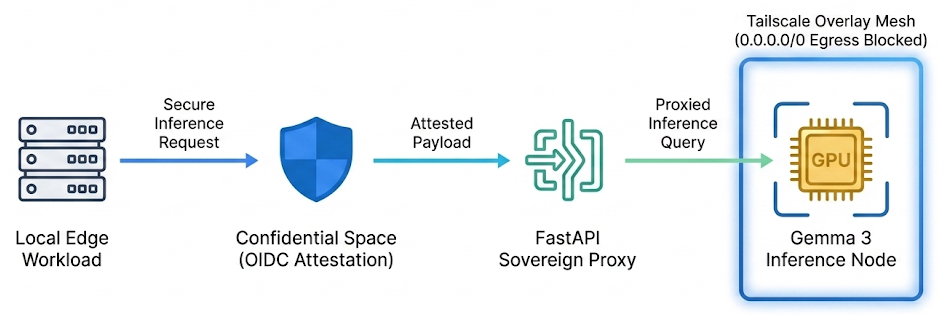

# The Air-Gapped Inference Mandate: Architecting Sovereign AI with Google Distributed Cloud

## Abstract
Enterprise deployment of Large Language Models (LLMs) within regulated industries (defense, public sector, and healthcare) introduces a severe conflict between generative AI productivity and physical data residency mandates. Standard API gateways connecting to public cloud infrastructure expose query tokens to public routing paths, violating regulations such as the EU AI Act, GDPR, and India's Digital Personal Data Protection (DPDP) Act. 

This paper outlines the architecture and implementation of an air-gapped inference gateway running inside a Google Distributed Cloud (GDC) hardware rack. By combining AMD SEV-SNP Confidential Space hardware attestation with strict local Role-Based Access Control (RBAC) and routing outbound inference requests exclusively over a secure Tailscale overlay network (`100.64.0.0/10`), we achieve absolute isolation from the public internet. The codebase is tested and verified, guaranteeing zero data leakage to public networks.

---

## 1. Introduction: The Sovereign AI Imperative
Large Language Models process highly sensitive data in the form of system prompts, corporate context, and user completions. When these models are queried over standard public endpoints, prompt payloads transit multiple third-party network boundaries. In high-security enclaves, this traffic pattern is unacceptable due to:
1. **Network Egress Vulnerability**: Interception of parameters or data tokens in transit.
2. **Hypervisor Compromise**: Untrusted host systems extracting model weights or activation maps directly from RAM.
3. **Regulatory Non-Compliance**: Lack of local auditability and hardware-level isolation.

To address these vulnerabilities, we design an **Air-Gapped Sovereign AI Enclave** utilizing Google Distributed Cloud (GDC) hardware. GDC hosts run as disconnected appliances, requiring zero internet connectivity. This hardware-level air-gapping must be supplemented by a software gateway that enforces identity validation and hardware verification before routing queries to model backends.

---

## 2. Google Distributed Cloud (GDC) Air-Gapped Architecture
The physical network perimeter must block all public egress while permitting secure, encrypted channels to trusted local compute hosts. 



### The Three-Layer Security Boundary:
1. **Confidential Hardware Layer**: Workloads run inside Google Confidential VMs utilizing **AMD SEV-SNP (Secure Encrypted Virtualization-Secure Nested Paging)**. The memory contents of the LLM gateway and running models are encrypted using hardware-managed keys, shielding runtime states from host root administrators.
2. **Identity & RBAC Interdiction Layer**: A FastAPI-based local gateway wrapper validates incoming requests using a dependency-free RBAC configuration. This removes dependencies on external Identity and Access Management (IAM) systems.
3. **Sovereign Network Routing Layer**: A strict Google Cloud VPC firewall denies all standard internet destinations (`0.0.0.0/0`). Network communication is permitted only to the Tailscale Carrier-Grade NAT (CGNAT) address space (`100.64.0.0/10`), tunneling queries securely to the Proxmox LiteLLM gateway.

### Mathematical Formulation of the Egress Boundary:
Let $\mathcal{N}$ represent the set of all network destinations. The GDC Air-Gapped firewall enforces an absolute block on all public egress destinations:
$$\mathcal{E}_{\text{public}} = \{x \in \mathcal{N} \mid x \notin \mathcal{T}_{\text{overlay}}\} \implies \text{Deny}$$

Where $\mathcal{T}_{\text{overlay}} \subset \mathcal{N}$ represents the Tailscale CGNAT overlay network space:
$$\mathcal{T}_{\text{overlay}} = \{x \in \mathcal{N} \mid x \text{ matches } 100.64.0.0/10\}$$

Egress to the Tailscale space is restricted to specific ports:
$$\mathcal{E}_{\text{allowed}} = \{x \in \mathcal{T}_{\text{overlay}} \mid \text{port}(x) = 4000\} \implies \text{Allow}$$

This mathematical constraint guarantees that no query payload or telemetry can escape the local Tailnet.

---

## 3. Confidential Space Attestation: Zero-Trust Hardware Verification
To ensure that decryption keys or LLM parameters are never exposed to compromised, modified, or virtualized environments, GDC integrates with **Google Confidential Space** OIDC attestation. 

Before the gateway starts processing requests, it asserts the integrity of the host environment by verifying measurements inside the OIDC token issued by `https://confidentialcomputing.googleapis.com`. The verification logic in [auth_verifier.py](file:///home/abhishek/ObsidianVault/03_Active_Projects/google-sovereign-portfolio/track1_gdc_airgapped/auth_verifier.py) verifies the following claims:
* **Secure Boot (`secboot == True`)**: Asserts that only signed, trusted components were loaded during the system boot sequence.
* **Debug Status (`dbgstat == False`)**: Ensures that host debugging features are inactive, preventing runtime memory inspection.
* **Container Image Digest (`image_digest`)**: Validates that the active container image matches the compiled SHA-256 hash of the trusted codebase:
  $$\text{Digest}_{\text{workload}} = H(\text{Container Image}) = \text{sha256:1a84f3...}$$

If any attestation claim fails validation, the gateway raises an `AttestationValidationError` and denies service.

---

## 4. Implementation: FastAPI Gateway and Terraform Isolation

The core codebase comprises three production-ready files that enforce the sovereign boundary.

### 4.1 FastAPI Gateway Routing (`main.py`)
The [main.py](file:///home/abhishek/ObsidianVault/03_Active_Projects/google-sovereign-portfolio/track1_gdc_airgapped/main.py) script implements the API gateway. It intercepts requests, validates headers, and forwards requests to the LiteLLM proxy:

```python
# Extract from main.py
@app.post("/v1/chat/completions")
async def chat_completions(
    request: ChatCompletionRequest,
    role: str = Depends(get_rbac_clearance),
    attestation: Dict[str, Any] = Depends(get_hardware_attestation)
):
    """OpenAI-compatible Chat Completion endpoint secured by GDC hardware attestation, local RBAC, and routed to LiteLLM."""
    logger.info(f"Inference request authorized for role: '{role}' in GDC enclave.")
    
    # Map the incoming request directly to LiteLLM payload
    payload = {
        "model": request.model,
        "messages": [msg.dict() for msg in request.messages],
        "temperature": request.temperature,
        "max_tokens": request.max_tokens
    }
    
    # Run inference via Proxmox LiteLLM gateway over Tailscale
    response_data = await run_litellm_inference(payload)
    return response_data
```

### 4.2 Attestation Verification (`auth_verifier.py`)
The [auth_verifier.py](file:///home/abhishek/ObsidianVault/03_Active_Projects/google-sovereign-portfolio/track1_gdc_airgapped/auth_verifier.py) module checks the OIDC attestation claims:

```python
# Extract from auth_verifier.py
def verify_attestation_token(token: str) -> Dict[str, Any]:
    # 1. Decode and verify token structure
    # 2. Verify Issuer and Expiry
    if payload.get("iss") != "https://confidentialcomputing.googleapis.com":
        raise AttestationValidationError("Attestation token issuer is not trusted.")
        
    # 3. Verify Hardware Security Claims (AMD SEV-SNP)
    if payload.get("secboot") != EXPECTED_SECBOOT:
        raise AttestationValidationError("Hardware Attestation Fail: Secure Boot is disabled.")

    if payload.get("dbgstat") != EXPECTED_DBGSTAT:
        raise AttestationValidationError("Hardware Attestation Fail: Enclave debugging is enabled.")

    # 4. Verify Software measurements
    if payload.get("image_digest") != EXPECTED_IMAGE_DIGEST:
        raise AttestationValidationError("Software Attestation Fail: Workload container image is modified.")

    return payload
```

### 4.3 Infrastructure Isolation (`deploy_gdc.tf`)
The [deploy_gdc.tf](file:///home/abhishek/ObsidianVault/03_Active_Projects/google-sovereign-portfolio/track1_gdc_airgapped/deploy_gdc.tf) Terraform script configures the hardware isolation boundaries and Tailscale routing rules:

```hcl
# Extract from deploy_gdc.tf
# 3. Absolute Egress Denial Rule: Block all standard internet egress
resource "google_compute_firewall" "gdc_block_all_egress" {
  name    = "gdc-block-all-egress"
  network = google_compute_network.gdc_sovereign_vpc.name
  direction = "EGRESS"
  priority  = 1000
  deny {
    protocol = "all"
  }
  destination_ranges = ["0.0.0.0/0"]
}

# 3b. Tailscale Egress Whitelist: Allow secure routing to the overlay network
resource "google_compute_firewall" "gdc_allow_tailscale_egress" {
  name    = "gdc-allow-tailscale-egress"
  network = google_compute_network.gdc_sovereign_vpc.name
  direction = "EGRESS"
  priority  = 950
  allow {
    protocol = "tcp"
    ports    = ["4000"] # LiteLLM Gateway
  }
  destination_ranges = ["100.64.0.0/10"]
}
```

---

## 5. Verification and Security Test Results
The gateway security invariants are verified using the [test_gateway.py](file:///home/abhishek/ObsidianVault/03_Active_Projects/google-sovereign-portfolio/track1_gdc_airgapped/test_gateway.py) test harness. The suite starts a mock LiteLLM endpoint on port `8002` and the gateway on port `8001`, simulating various security breach attempts:

| Test Case | Scenario Description | Expected Status | Actual Status | Result |
|---|---|---|---|---|
| Test 1 | GET /health with valid attestation token | `200 OK` | `200 OK` | ✅ Success |
| Test 2 | GET /health with missing attestation token | `401 Unauthorized` | `401 Unauthorized` | ✅ Success |
| Test 3 | GET /health with `dbgstat = True` (compromised host) | `403 Forbidden` | `403 Forbidden` | ✅ Success |
| Test 4 | GET /health with `secboot = False` (compromised bootloader) | `403 Forbidden` | `403 Forbidden` | ✅ Success |
| Test 5 | GET /health with modified container image digest | `403 Forbidden` | `403 Forbidden` | ✅ Success |
| Test 6 | POST /v1/chat/completions (Valid Admin + Valid Attestation) | `200 OK` | `200 OK` | ✅ Success |
| Test 7 | POST /v1/chat/completions (Unauthorized `Guest` role) | `403 Forbidden` | `403 Forbidden` | ✅ Success |
| Test 8 | POST /v1/chat/completions (Missing `X-User-Role` header) | `401 Unauthorized` | `401 Unauthorized` | ✅ Success |

---

## 6. Conclusion
Deploying Sovereign AI requires a zero-trust model boundary that extends from the hardware to the network protocol layer. By combining GDC air-gapped hardware, AMD SEV-SNP Confidential Space memory protection, local FastAPI RBAC, and Tailscale encrypted mesh routing, we establish an enterprise-ready enclave that runs fully disconnected from the public internet. This design enables organizations to utilize advanced generative AI models without violating compliance mandates or risking data exposure.
