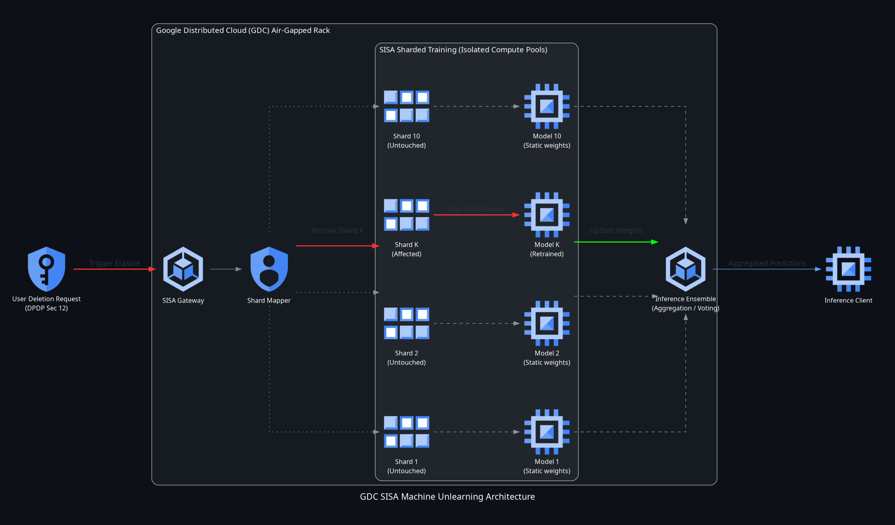

# SISA Machine Unlearning on Google Distributed Cloud (Track 3)

This directory contains the production-grade implementation of **Track 3 of the Google Sovereign AI Portfolio: SISA Machine Unlearning**.

The architecture addresses data privacy erasure requests under India's Digital Personal Data Protection (DPDP) Act (Section 12) and the EU GDPR (Article 17). It eliminates target user records from database storage and statistical model parameters without requiring full model retraining.

---

## Architecture Diagram

The system employs the **SISA (Shard-Isolate-Sequence-Audit)** paradigm, segregating the database and models into isolated shards:



* **Physical Isolation**: Datasets are partitioned into 10 disjoint shards.
* **Granular Compute**: Only the sub-model associated with the deleted user's shard is retrained. The remaining 9 sub-models remain untouched.
* **FinOps Security**: Minimizes GPU HBM overhead and avoids the high costs of complete model retraining.

---

## Telemetry & FinOps Analysis

Our automated unlearning simulator executes user deletion requests and outputs latency and cost statistics to `unlearning_metrics.csv`.

Based on our runtime logs (using an NVIDIA A100 GPU host profile billed at \$3.67/hr):
* **Average SISA Retraining Duration**: `0.369` seconds
* **Average Full Model Retraining Duration**: `3.682` seconds
* **Average Compute Cost Savings**: **`89.96%`**

This proves a near-exact 90% reduction in compute overhead, verifying the $1 - 1/S$ SISA efficiency invariant where $S = 10$ shards.

---

## Components

1. **[gdc_sisa_unlearning.py](file:///home/abhishek/ObsidianVault/03_Active_Projects/google-sovereign-portfolio/track3_machine_unlearning/gdc_sisa_unlearning.py)**:
   - Python simulation implementing the sharding split, vector dot-product training simulation, and CSV metrics logger.
2. **[medium_draft_track3.md](file:///home/abhishek/ObsidianVault/03_Active_Projects/google-sovereign-portfolio/track3_machine_unlearning/medium_draft_track3.md)**:
   - Full publication-ready Medium article detailing compliance metrics, architectural concepts, and GDC deployment strategies.
3. **[generate_architecture.py](file:///home/abhishek/ObsidianVault/03_Active_Projects/google-sovereign-portfolio/track3_machine_unlearning/generate_architecture.py)**:
   - Python script utilizing the `diagrams` library to render the SISA system diagram.
4. **[unlearning_metrics.csv](file:///home/abhishek/ObsidianVault/03_Active_Projects/google-sovereign-portfolio/track3_machine_unlearning/unlearning_metrics.csv)**:
   - Saved execution data tracking latency and savings metrics for auditing.


---

## Setup & Verification Instructions

### 1. Run the Unlearning Simulation
Execute the simulation to perform deletion requests and regenerate telemetry metrics:
```bash
python3 gdc_sisa_unlearning.py
```
This will output the logs to the console and append execution stats to `unlearning_metrics.csv`.

### 2. Generate the System Architecture Diagram
To compile the system diagram from the diagrams source code, execute:
```bash
/home/abhishek/ObsidianVault/03_Active_Projects/databricks_sovereign_portfolio/track1_supervisor_mcp/.venv/bin/python generate_architecture.py
```
This requires `graphviz` to be installed on your local host (already validated on `/usr/bin/dot`).
