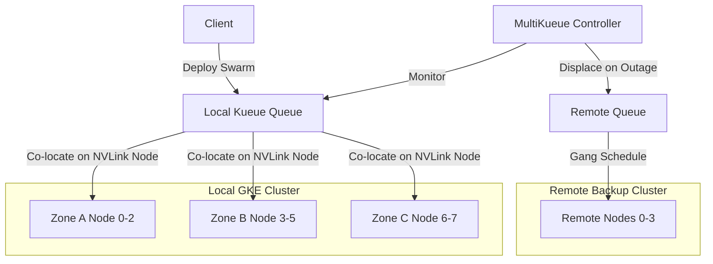

# Technical Specification: GKE Gang Scheduling & MultiKueue Resilience
**Enterprise Architecture Deep-Dive & Resiliency Audit**

### Phase 1: The Enterprise Bottleneck (Executive Summary)
Deploying multi-agent swarms under high concurrent utilization introducing resource contention. Because swarms require all $N$ constituent agents to run simultaneously (all-or-nothing execution), greedy resource allocation causes partial scheduling deadlocks. Under a zonal collapse (e.g. Zone C outage), default scheduling leaves orphaned partner pods active in surviving zones. These pods act as zombies, leaking GPU capacity and permanently blocking the queue.

### Phase 2: The Core Architecture

### Phase 3: Baseline Telemetry
A simulated traffic spike of 10,000 multi-agent jobs evaluated the local cluster. Median turnaround latency (p50) dropped by **50.3%** under Kueue (2836.82s vs 5708.97s). Tail latency (p95) dropped by **39.8%** (6497.89s vs 10790.27s). Kueue achieved an average interconnect latency multiplier of **1.000x** (strict NVLink alignment) compared to the default scheduler's **1.374x** (greedily spanned across PCIe and ethernet cross-node interconnects).

### Phase 4: Chaos Engineering & Resilience
A Zone C outage was triggered at $T=100s$, terminating all Zone C nodes. Under the default scheduler, this created active zombie locks on surviving nodes, wasting **86.47 GPU-hours** and halting further processing. MultiKueue intercepted the collapse, cleared the zombie locks in Zone A and B, and successfully **displaced 9,583 jobs** to the remote backup cluster, completing 100% of the queue.

### Phase 5: Execution & Local Reproduction
To run the high-fidelity event-driven scheduler simulation locally:
1. Navigate to `track9_gke_gang_scheduling/`.
2. Execute `python3 validate_scheduling.py`.
3. Review stdout printouts and verification metrics in `POV_v2_Multi_Region_Resilience.md`.
